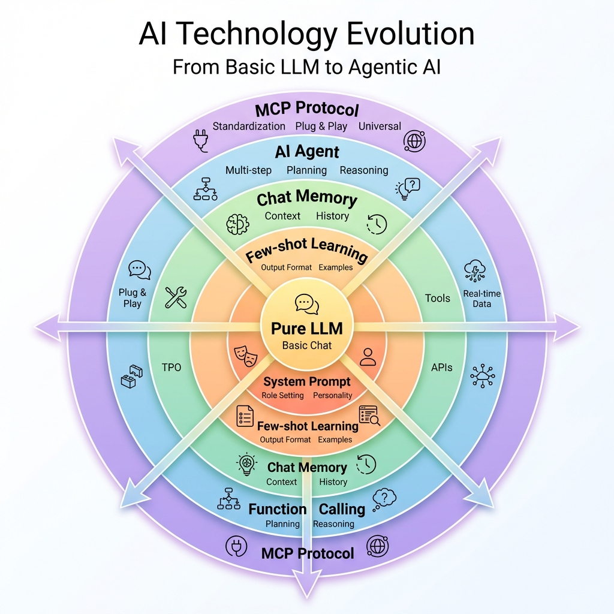

# AI Learning Lab 🧪

An interactive Blazor web application for teaching AI technology evolution — from basic LLM calls to MCP (Model Context Protocol).

[🇹🇼 繁體中文](../../README.md)

## 📊 AI Technology Evolution



## 🎯 Features

- **7 Progressive Levels** — Each level solves the previous level's problem
- **Side-by-Side Comparison** — See how each technique improves AI responses
- **Collapsible Code Snippets** — Learn what code is needed for each level
- **Real-time Demos** — Actually call Azure OpenAI to see results
- **Multi-language** — Supports English and Traditional Chinese

## 🏗️ Technology Levels

| Level | Name | What It Adds | Problem It Solves |
|-------|------|--------------|-------------------|
| L1 | Pure LLM | Basic chat | - |
| L2 | System Prompt | Role/identity | No consistency |
| L3 | Few-shot | Example outputs | Unpredictable format |
| L4 | Chat Memory | Conversation history | Forgetful AI |
| L6 | Function Calling | Tool invocation | No real-time data |
| L7 | Agent | Multi-step reasoning | Manual orchestration |
| L8 | MCP | Standard protocol | Tool integration effort |

## 🚀 Quick Start

### Prerequisites

- .NET 10.0 SDK
- Azure OpenAI or LiteLLM endpoint

### Configuration

1. Edit `appsettings.json`:

```json
{
  "LlmProvider": {
    "Provider": "AzureOpenAI"
  },
  "AzureOpenAI": {
    "Endpoint": "https://your-resource.openai.azure.com/",
    "ApiKey": "your-api-key",
    "DeploymentName": "gpt-4o"
  }
}
```

2. Run:

```bash
dotnet run
```

3. Open http://localhost:5062

## 💡 Suggested Test Cases

| Level | Input | Expected Behavior |
|-------|-------|-------------------|
| L1 vs L2 | "What is the return policy?" | L1 = generic, L2 = brand-specific |
| L3 | "This product is terrible" | Returns JSON: `{"sentiment":"negative"}` |
| L4 | "My name is John" then "What's my name?" | Remembers "John" |
| L6 | "Taipei weather" | Calls weather tool |
| L7 | "Check weather, if sunny book a meeting room" | Multi-step reasoning |

## 📂 Project Structure

```
AiLearningLab/
├── Components/
│   ├── Layout/MainLayout.razor    # Sidebar with language switcher
│   └── Pages/Home.razor           # Single-page with all levels
├── Services/
│   ├── LlmService.cs              # L1-L4 implementations
│   ├── AgentService.cs            # L6-L7 implementations
│   └── McpService.cs              # L8 MCP connection
├── Resources/                     # Localization files
│   ├── SharedResource.en.resx     # English
│   └── SharedResource.zh-TW.resx  # Traditional Chinese
├── Plugins/
│   └── DemoPlugin.cs              # Sample tools
└── Models/
    └── LearningLevel.cs           # Level metadata
```

## 🛠️ Tech Stack

- **Frontend**: Blazor Server (.NET 10)
- **AI**: Azure OpenAI / LiteLLM
- **Frameworks**: Microsoft.Extensions.AI, Microsoft.Agents.AI

## 📝 License

MIT
